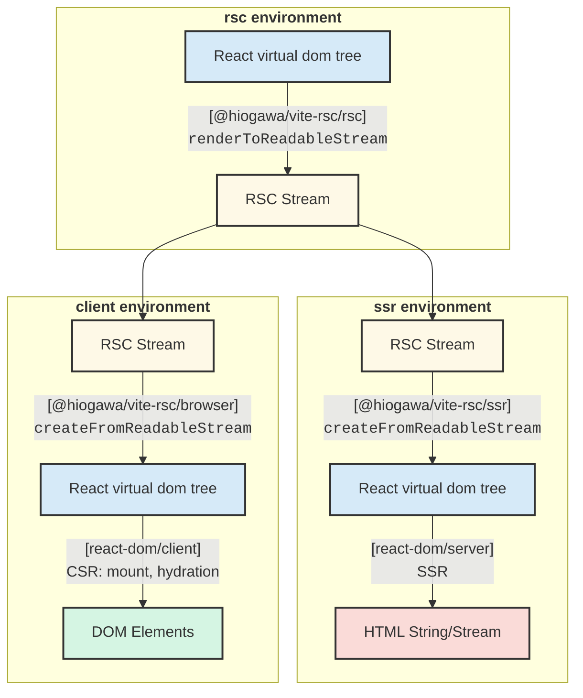

# @hiogawa/vite-rsc

This package provides [React Server Components](https://react.dev/reference/rsc/server-components) (RSC) support for Vite.
Any feedback is welcome, please feel free to share an idea in [the discussion](https://github.com/hi-ogawa/vite-plugins/discussions/979).

## Features

- **Framework-less RSC experience**: The plugin implements [RSC conventions](https://react.dev/reference/rsc/server-components) and provides low level `react-server-dom` runtime API without framework-specific abstractions.
- **CSS support**: CSS is automatically code-split at client boundaries and injected upon rendering. For server components, CSS assets can be manually rendered via `import.meta.viteRsc.loadCss` API based on your own server routing conventions.
- **HMR support**: Enables editing both client and server components without full page reloads.
- **Runtime agnostic**: Built on [Vite environment API](https://vite.dev/guide/api-environment.html) and works with other runtimes (e.g., [`@cloudflare/vite-plugin`](https://github.com/cloudflare/workers-sdk/tree/main/packages/vite-plugin-cloudflare)).

## Getting Started

You can start a project by copying an example locally by:

```sh
npx degit hi-ogawa/vite-plugins/packages/rsc/examples/starter my-app
```

## Examples

- [`./examples/starter`](./examples/starter)
  - This example provides an in-depth overview of API with inline comments to explain how they function within RSC-powered React application.
- [`./examples/starter-cf-single`](./examples/starter-cf-single)
  - [`@cloudflare/vite-plugin`](https://github.com/cloudflare/workers-sdk/tree/main/packages/vite-plugin-cloudflare) integration example with a single worker setup.
- [`./examples/react-router`](./examples/react-router)
  - This demonstrates how to integrate [experimental React Router RSC API](https://remix.run/blog/rsc-preview) with this plugin. It also includes `@cloudflare/vite-plugin` integration with multi workers setup.
- [`./examples/basic`](./examples/basic)
  - This is mainly used for e2e testing and include various edge cases. It also uses a high level `@hiogawa/vite-rsc/extra/{rsc,ssr,browser}` API for quick setup.

## Basic Concepts

This example is a simplified version of [`./examples/starter`](./examples/starter). You can read [`./examples/starter/src/framework/entry.{rsc,ssr,browser}.tsx`](./examples/starter/src/framework) for more in-depth commentary, which includes server function handling and client-side RSC re-fetching/re-rendering.

This is the diagram to show the basic flow of RSC rendering process. See also https://github.com/hi-ogawa/vite-plugins/discussions/606.



- [`vite.config.ts`](./examples/starter/vite.config.ts)

```js
import rsc from "@hiogawa/vite-rsc/plugin";

export default defineConfig() {
  plugins: [
    // add plugin
    rsc(),
  ],

  // specify entry point for each environment.
  // (currently the plugin assumes `rollupOptions.input.index` for some features.)
  environments: {
    // `rsc` environment loads modules with `react-server` condition.
    // this environment is responsible for:
    // - RSC stream serialization (React VDOM -> RSC stream)
    // - server functions handling
    rsc: {
      build: {
        rollupOptions: {
          input: {
            index: "./src/framework/entry.rsc.tsx",
          },
        },
      },
    },

    // `ssr` environment loads modules without `react-server` condition.
    // this environment is responsible for:
    // - RSC stream deserialization (RSC stream -> React VDOM)
    // - traditional SSR (React VDOM -> HTML string/stream)
    // (NOTE: as it can be seen in the above diagram. SSR is technically an optional mechanism.)
    ssr: {
      build: {
        rollupOptions: {
          input: {
            index: "./src/framework/entry.ssr.tsx",
          },
        },
      },
    },

    // client environment is used for hydration and client-side rendering
    // this environment is responsible for:
    // - RSC stream deserialization (RSC stream -> React VDOM)
    // - traditional CSR (React VDOM -> Browser DOM tree mount/hydration)
    // - refetch and re-render RSC
    // - calling server functions
    client: {
      build: {
        rollupOptions: {
          input: {
            index: "./src/framework/entry.browser.tsx",
          },
        },
      },
    },
  },
}
```

- [`entry.rsc.tsx`](./examples/starter/src/framework/entry.rsc.tsx)

```tsx
import * as ReactServer from "@hiogawa/vite-rsc/rsc"; // re-export of react-server-dom/server.edge

// the plugin assumes `rsc` entry having default export of request handler
export default async function handler(request: Request): Promise<Response> {
  // serialization React VDOM to RSC stream
  const root = <html><body><h1>Test</h1></body></html>;
  const rscStream = ReactServer.renderToReadableStream(root);

  // respond direct RSC stream request based on framework's convention
  if (request.url.endsWith(".rsc")) {
    return new Response(rscStream, {
      headers: {
        'Content-type': 'text/html'
      }
    })
  }

  // delegate to SSR environment for html rendering
  // `loadSsrModule` is a helper API provided by the plugin for multi environment interaction.
  const ssrEntry = await import.meta.viteRsc.loadSsrModule<typeof import("./entry.ssr.tsx")>();
  const htmlStream = await ssrEntry.handleSsr(rscStream);

  // respond html
  return new Response(htmlStream, {
    headers: {
      'Content-type': 'text/html'
    }
  })
}
```

- [`entry.ssr.tsx`](./examples/starter/src/framework/entry.ssr.tsx)

```tsx
import * as ReactClient from "@hiogawa/vite-rsc/ssr"; // re-export of react-server-dom/client.edge
import * as ReactDOMServer from "react-dom/server.edge";
// helper API to allow referencing browser entry content from SSR environment
import bootstrapScriptContent from "virtual:vite-rsc/bootstrap-script-content";

export async function handleSsr(rscStream: ReadableStream) {
  // deserialize RSC stream back to React VDOM
  const root = await ReactClient.createFromReadableStream(rscStream);

  // render html (traditional SSR)
  const htmlStream = ReactDOMServer.renderToReadableStream(root, {
    bootstrapScriptContent,
  })

  return htmlStream;
}
```

- [`entry.browser.tsx`](./examples/starter/src/framework/entry.browser.tsx)

```tsx
import * as ReactClient from "@hiogawa/vite-rsc/browser"; // re-export of react-server-dom/client.browser
import * as ReactDOMClient from "react-dom/client";

async function main() {
  // fetch and deserialize RSC stream back to React VDOM
  const rscResponse = await fetch(window.location.href + ".rsc");
  const root = await ReactClient.createFromReadableStream(rscResponse.body);

  // hydration (traditional CSR)
  ReactDOMClient.hydrateRoot(document, root);
}

main();
```

## `react-server-dom` API

### `@hiogawa/vite-rsc/rsc`

This module re-exports RSC runtime API provided by `react-server-dom/server.edge`

- `renderToReadableStream`: RSC serialization (React VDOM -> RSC stream)
- `createFromReadableStream`: RSC deserialization (RSC stream -> React VDOM). This is also available on rsc environment itself. For example, it allows saving serailized RSC and deserializing it for later use.
- `decodeAction/decodeReply/loadServerAction`: server function related...

### `@hiogawa/vite-rsc/ssr`

This module re-exports RSC runtime API provided by `react-server-dom/client.edge`

- `createFromReadableStream`: RSC deserialization (RSC stream -> React VDOM)

### `@hiogawa/vite-rsc/browser`

This module re-exports RSC runtime API provided by `react-server-dom/client.browser`

- `createFromReadableStream`: RSC deserialization (RSC stream -> React VDOM)
- `createFromFetch`: a robust way of `createFromReadableStream((await fetch("...")).body)`
- `encodeReply/setServerCallback`: server function related...

## Environment helper API

The plugin provides an additional helper for multi environment interaction.

### `rsc` environment

#### `import.meta.viteRsc.loadSsrModule`

- Type: `(entryName: string) => Promise<T>`

This allows importing `ssr` environment module specified by `environments.ssr.build.rollupOptions.input[entryName]` inside `rsc` environment. This API assumes `rsc` and `ssr` environments executes modules under the main Vite process.
When that's not the case, the communication between two environments needs to be implemented on your own (e.g. `@cloudflare/vite-plugin` provides service binding features to achieve a similar mechanism).

```js
// inside rsc environment
const ssrModule = await import.meta.viteRsc.loadSsrModule("index");
ssrModule.renderHtml(...)
```

#### `import.meta.viteRsc.loadCss`

- Type: `(options?: { id?: string }) => React.ReactNode`

This allows collecting css which is imported through a current server module and injecting them inside server components.

```tsx
import "./test.css";
import dep from "./dep.tsx";

export function ServerPage() {
  // this will include css assets for "test.css"
  // and any css transitively imported through "dep.tsx"
  return <>
    {import.meta.viteRsc.loadCss()}
    ...
  </>
}
```

Where specifying `id` in `loadCss({ id: "..." })`, it will crawl css through given server module `id`.

### `ssr` environment

#### `virtual:vite-rsc/bootstrap-script-content`

This provides a raw js code to execute a browser entry file specified by `environments.client.build.rollupOptions.input.index`. This is intended to be used with React DOM SSR API, such as [`renderToReadableStream`](https://react.dev/reference/react-dom/server/renderToReadableStream)

```js
import bootstrapScriptContent from "virtual:vite-rsc/bootstrap-script-content"
import { renderToReadableStream } from "react-dom/server.edge";

renderToReadableStream(reactNode, { bootstrapScriptContent });
```

## Plugin API

```js
import rsc from "@hiogawa/vite-rsc/plugin";
import { defineConfig } from "vite";

export default defineConfig({
  plugins: [
    rsc({
      // this is only a shorthand of specifying each
      // `environments[name].build.rollupOptions.input.index`
      entries: {
        rsc: "...",
        ssr: "...",
        client: "...",
      },
    }),
  ],
  environments: {
    rsc: {
      define: {
        // The plugin uses an encryption key for "use server" closure argument binding,
        // which is generated at build time by default (and it makes rsc build non-deterministic).
        // This can be overwritten by configuring `define.__VITE_RSC_ENCRYPTION_KEY__`,
        // for example, to obtain a key through envrionment variable during runtime.
        // cf. https://nextjs.org/docs/app/guides/data-security#overwriting-encryption-keys-advanced
        __VITE_RSC_ENCRYPTION_KEY__: "process.env.MY_ENCRYPTION_KEY",
      }
    }
  },
});
```

## Higher level API

This is a wrapper of `react-server-dom` API and helper API to setup a minimal RSC app without writing own framework code like [`./examples/starter/src/framework`](./examples/starter/src/framework/). See [`./examples/basic`](./examples/basic/) for how this API is used.

### `@hiogawa/vite-rsc/extra/rsc`

- `renderRequest`

### `@hiogawa/vite-rsc/extra/ssr`

- `renderHtml`

### `@hiogawa/vite-rsc/extra/browser`

- `hydrate`
